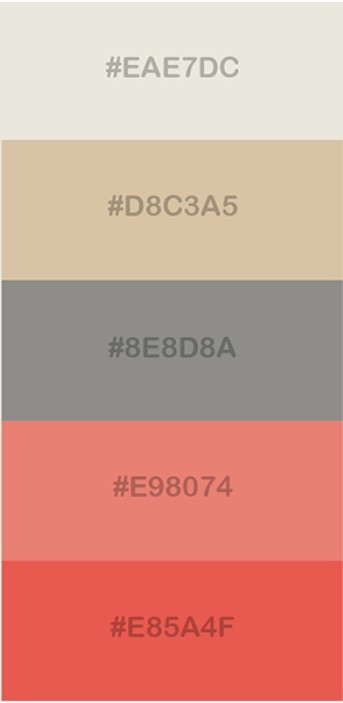
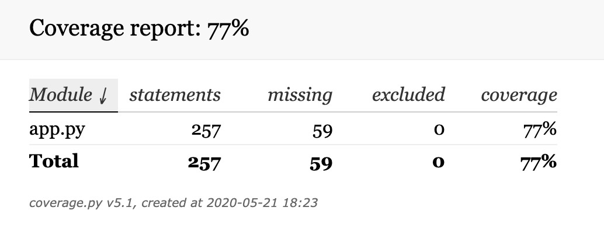

# Poldi's Cookbook

* LIVELINK of final version: https://poldis-cookbook.herokuapp.com/ 

* GITHUB final version: https://github.com/poldi2018/poldis_cookbook

>> Please note, that there was a problem with versioning after moving code from my initial draft version. That draft version shows the different commits from the past which do occur in final version as one commit. It is accessible here: https://github.com/poldi2018/recipe_DRAFT<<

# USER STORIES / REQUIREMENTS 

* As a user I would like to have the possibility to create, read, update and delete my recipes in an online platform to have access from everywhere.

* Only the author should be able to alter the content or delete the recipe.

* I want to be able to quickly search for recipes containing an ingredient

* I want to write reviews for a recipe

* Special allergens need to be marked with some sort of warning

* Recipes need to be categorized. 

* Entered data need to be checked to be database conform before save operation.

* Userdata must be kept confidential.

# FEATURES:

* Creation of recipes and ratings are bound to user accounts
* Author has the option to edit and delete the recipe.
* full text search is available.
* image upload illustrating the prepared dish
* Recipe review function is present. 
* ingredients can be marked as allergens. Those marked allergens ingredients have a warning symbol.

For now, the user can select from following dish-type categories

1. STARTERS
* Soup
* Salad
* Fingerfood

2. MAIN COURSE
* Chicken
* Fish
* Game
* Meet
*Vegetarian

3. DESSERTS
* Cake
* Dessert
* Fruit
* Ice

4. DRINKS
* Juice
* Shake
* Cocktail

# The mockups / wireframes can be found in this folder:

(https://github.com/poldi2018/poldis_cookbook/tree/master/static/data/mockups)

## Color scheme

# DATABASE SCHEME

The database record has the following structure

# Technologies used in this project

* HTML for browser presentation, https://www.w3.org/html/
* CSS with SCSS and MATERIALIZE for styling the frontend.
* JAVASCRIPT for handling of form validation and DOM frontend
* JQUERY for manipulation of DOM elements, https://jquery.com
* PYTHON with FLASK for backend engine, https://www.python.org/
* JINJA2 was used for processing python data in template HTML files.
* MongoDB for hosting of database, https://mongodb.com
* IMGBB for uploaded dish images, https://imgbb.com/
* HEROKU for deploying project to the web, https://heroku.com/
* BALSAMIQ has been used for creation of wireframes, https://balsamiq.com/
* DC and D3 for visualisation on welcome page, https://dc-js.github.io/dc.js/ 
* FONTAWESOME for icons, https://fontawesome.com/
* BOOTSTRAP for using layouts, https://getbootstrap.com/
* AUTOPREFIXER was used to get the CSS vendor codes, https://autoprefixer.github.io/
* GITHUB for code version handling

# LOCAL DEPLOYMENT

To run this project locally, the following steps need to be done:

1. IMGBB image hosting account
* create a account for image hosting at IMGBB, https://imgbb.com/.
* Please log into the imgbb portal and write down the API key, found in drop down menu (upper left corner) "About->API-> Get API key

2. ATLAS MONGODB database hosting account
* After filling the registration for a MongoDB account on https://www.mongodb.com , there has to be created a cluster with a Tier of your choice. To access that cluster you need to create a user as well. Please refer to the documentation for cluster creation and user management.
In cluster overview click on 'collections' button and then 'create database'. To run this project, it needs a database with 3 collections:

* recipes
* reviews
* users
 
In cluster overview click on 'Connect' button to connect to MongoDB with an application (middle).

You should then obtain a string like this:

mongodb+srv://<username>:<password>@<clustername>-wzrde.mongodb.net/test?retryWrites=true&w=majority

Please replace the following 3 parameters with your personalised details:
* <username> username of the user for database access
* <password> password of the user for accessing the database 
* <clustername> The name of your created, personal cluster

## CLONING THE PROJECT 

* Create a project in IDE and clone it by executing the bash command

git clone https://github.com/poldi2018/poldis_cookbook.git

* In working directory of that project please create a file (e.g. env.py) to host the following env variables.

import os

os.environ.setdefault("SECRET_KEY", "YOUR-SECRET-KEY")

os.environ.setdefault("IMGBB_CLIENT_API_KEY", "YOUR-API-KEY")

os.environ.setdefault("MONGO_URI_COOKBOOK", "The URL provided by MongoDB")

* !! Add the env.py file to .gitignore file !!

* The next step is to install the resources from requirements.txt file by using the command

pip install -r requirements.txt

## DEPLOYMENT ON HEROKU

In order to deploy this project to the web, please create an account at https://heroku.com/ and create an app with a unique name, region Europe. Write down the provided url for later call to run the project.

On settings tab, click on 'Reveal Config Vars' and add the following variables.

* SECRET_KEY = A key of your choice
* IMGBB_CLIENT_API_KEY = Obtained API key from IMGBB
* MONGO_URI_COOKBOOK = The URL provided by MongoDB
* IP = 0.0.0.0
* PORT = 5000

Please copy the url in deploy section on Heroku. The command 
to add the heroku site as a remote to push to should look like this:

heroku git:remote -a YOURPROJECT-URL.git.

Finally, the project need to be pushed to Heroku platform by executing

git push heroku master

# CURRENT ISSUES

* addressing an album in imgbb database is not possible. Passing a key-value pair like {“album”: “test”} inside the data dictionary did not succeed, nor throwed an error.
So for now all images are being uploaded into one bucket on IMGBB.

# FUTURE FEATURES:

* future version should check on collection file size to prevent exceeding 16MB

* update countries.json with full country name to be able to search origin country's full name.

* pagination feature is needed to keep the dataset handling responsive.

* The information of users who rated a recipe has been written to 'rated_by_users' in database but data field is not implemented in read dialog (yet).

# ACKNOWLEDGEMENT:

* tutsmake for converting image into base64  and using the FileReader Object
  "https://www.tutsmake.com/convert-image-to-base64-string-jquery/"

* mongoDB documentation for additional information on CRUD operations and text indexing.

* email format string taken from validator w3 resources, https://www.w3resource.com/javascript/form/email-validation.php

* mini-flags images are taken from https://flagpedia.net/download

* stackoverflow has been used to check for certain commands. Afterwards I consulted Python.org reference for further details.

* dc charting script and code was taken from Code-Institute course program and adapted. 

* Codekernel was used to get information on testing code in flask, using unittest, coverage and nose:
https://codekernel.co.uk/posts/flask-testing-unittest-and-coverage/

* https://autoprefixer.github.io/ was used to get the CSS vendor codes.

* Sample recipes (instructions and pictures) have been taken from https://www.themealdb.com/
 
 ### Beside from above mentioned acknowledgements NO other code has been copied.

# COMPLIANCE:
Compliance reports can be found in reports folder:

(https://github.com/poldi2018/poldis_cookbook/tree/master/static/data/reports)

* CSS DONE
* HTML SKIPPED (as Jinja code is not recognized)
* JShint DONE
* PEP8 DONE
* Jasmine SKIPPED

# TESTING OF CODE
* The frontend was tested in different browsers such as Safari, Chrome and Firefox on both iphone and mac.

## TEST OF JAVASCRIPT CODE

The automatic testing with Jasmine has been skipped, because I received inconsistent results of checks for Jquery altered DOM elements.
But: I tested the following conditions manually:

* Adding and removing ingredient fields. Checks have been done for correct parameters of DOM elements such as naming, id assignment and the 'for' attribute of labels

* handling of added images via the filereader function (so a valid .jpeg / .jpg image has been selected)

* Disabling of file input field for the cases that the former uploaded image should be used, or to upload an image at a later stage (to use dummy).

* Calculation of Total preparation time

* Proper generation of amount-, ingredient- and allergens string to pass to Python engine

* All fields to be conform in length and that they are filled when a recipe is being created or edited. Those fields which need to only contain numbers have been validated, too.

* That popups are properly displayed and contain the correct error message of field validation outcome.

* Fields have been checked before a review is being sent to save.

* Forms for user registration to contain a valid email address and identical password fields.

* Sizing of buttons in read recipe view, depending on logged in status or being the author.

* Function of side menu on mobiles.

## TEST OF PYTHON CODE WITH UNITTEST / NOSE:

All methods except two have been tested by using unittest / nosetests.

The test files for methods and views are located here:

(https://github.com/poldi2018/poldis_cookbook/tree/master/tests)

## A detailed coverage report is available here:

(https://github.com/poldi2018/poldis_cookbook/blob/master/htmlcov/index.html)

* Initial attempt to implement CI/CD with Travis-CI failed and has been removed. Local tests  run by unittest went fine, but failed all the time in Travis environment. The testing of MongoDB failed with below error log:

(https://github.com/poldi2018/poldis_cookbook/blob/master/static/data/reports/TravisCI-CD.txt)

This project has been created to demonstrate learning outcomes only.

<EOF> 
